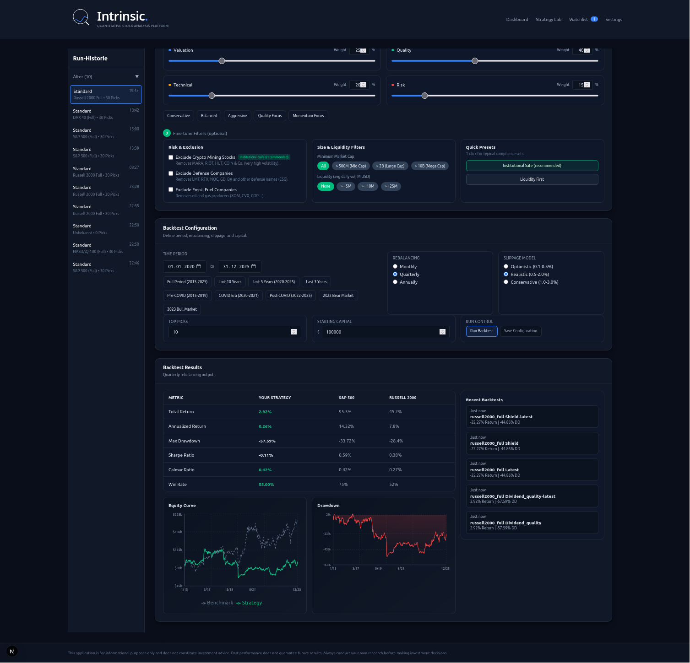

# Intrinsic

Deterministic Stock Analysis Platform.

Intrinsic kombiniert regelbasiertes Aktien-Scoring, Backtesting und Regime-bewusste Portfolio-Logik in einer transparenten Oberfläche.

## Produkt-Screens


| Backtesting | Stock Explainability |
|---|---|
|  |  |

## Warum Intrinsic

- Keine Blackbox: Regeln und Formeln sind vollstaendig dokumentiert.
- Reproduzierbar: gleiche Inputs liefern gleiche Outputs.
- Regime-aware: Asset-Exposure passt sich an Marktzustände an (`RISK_ON`, `NEUTRAL`, `RISK_OFF`, `CRISIS`).
- Investor-ready UI: Strategy Lab, Backtests, Stock Forensics, Briefing Grid.

## Transparenz-Links

- Vollstaendige Berechnungen: `docs/CALCULATION_REFERENCE.md`
- Formel-Auszug in LaTeX: `docs/CALCULATION_REFERENCE.tex`
- Investor Executive (LaTeX): `docs/INVESTOR_EXECUTIVE_SUMMARY.tex`
- Technisches README: `docs/README_TECHNICAL.md`
- Woechentlicher Tech-Auszug: `docs/TECHNICAL_WEEKLY.md`

## Schnellstart

```bash
npm install --legacy-peer-deps
npm run dev
```

Dann im Browser: `http://localhost:3000`

## Dokumente als PDF bauen (lokal)

```bash
npm run docs:latex
npm run docs:investor
```

## Roadmap (Teaser)

- Regime-Wechsel pro Rebalance visualisieren.
- Standardmaessige A/B-Auswertung je Preset (mit vs. ohne Regime-Overlay).
- Tiefere Explainability pro Rebalance (Signal, Gewichts-Shift, Cash-Quote).

## Hinweis

Intrinsic ist ein Research- und Analyse-Tool, keine Anlageberatung.
